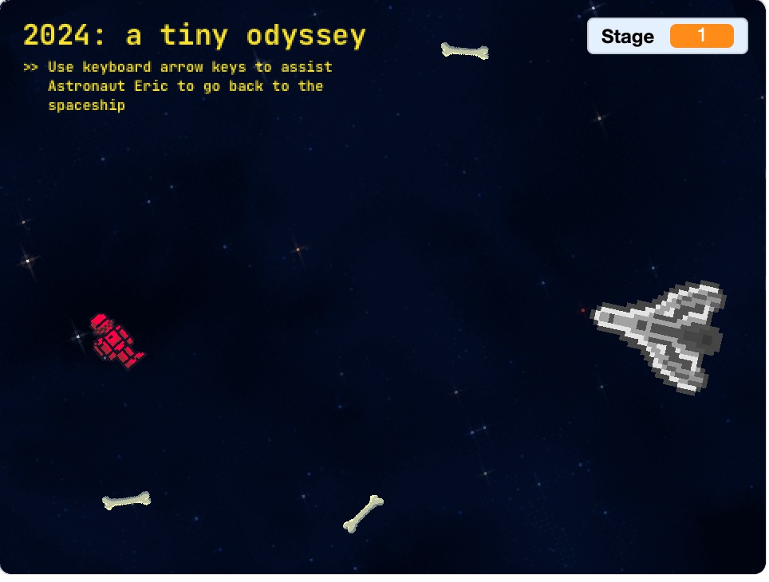
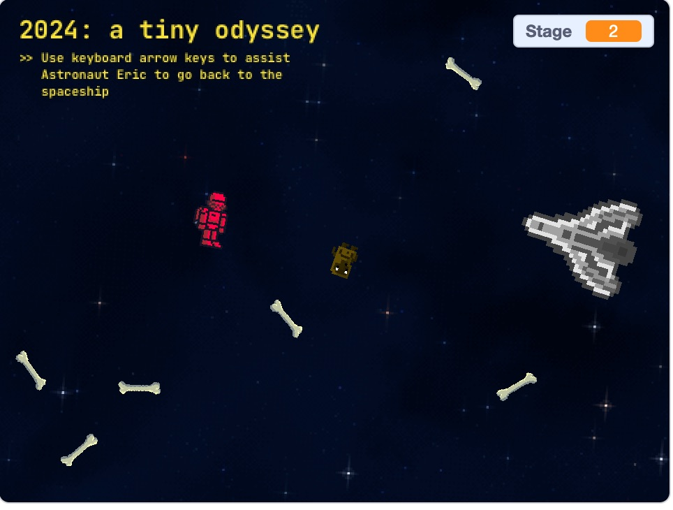

# 2024: a tiny odyssey

CS50x problem set 0 in Scratch

## Link

https://scratch.mit.edu/projects/960428526

<iframe src="https://scratch.mit.edu/projects/960428526/embed" allowtransparency="true" width="485" height="402" frameborder="0" scrolling="no" allowfullscreen></iframe>

## Inspiration 

- Tried to turn a classic film scene into a mini game. 
- 2001: a space odyssey, or Blade Runner as a 2D platformer game. 
- 2001 was the final choice because the Scratch stage dimension is small. 2001 scene is geometric and minimal, which gives a clean aesthetic.  

## Imprementation 

- Starfield background is rotating as if viewing from Earth. 
- All sprites rotate as if they are floating in the space. 
- Bone obstacle moves randomly. 
- Monkey obstacle chase towards the Astronaut. 

## Credits

- Background - https://space-spheremaps.itch.io/pixelart-starfields
- Astronaut - https://jaydenirwin.itch.io/sci-fi-soldiers
- Spaceship - https://opengameart.org/content/space-ships-2
- Bone - https://opengameart.org/content/pixel-art-femur
- Monkey - https://opengameart.org/content/pixel-monkey
